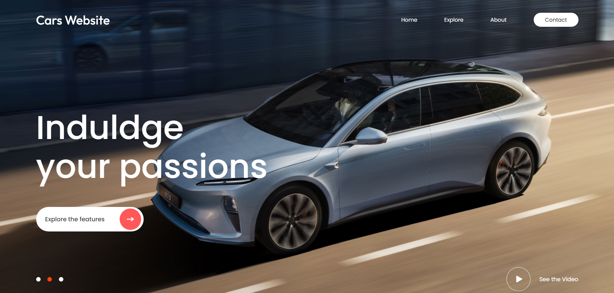

# evcars-react-header

An interactive electric cars website header built with React.js. Includes dynamic animations, a background video with playback controls, and a full-screen image slider with fade transitions.

# EV Cars React Header

This project is a modern and interactive header design for an electric vehicles website. It's built using **React.js** and showcases a variety of features to enhance user experience.

## Features
- **Background Video with Playback Controls**: Adds dynamic visuals with user control to play/pause the video.
- **Full-Screen Image Slider**: Automatically transitions between images every 3 seconds with smooth fade-in/out animations.
- **Responsive Design**: Ensures a seamless experience across devices.
- **Fade Animations**: Smooth entry and exit effects for images to enhance interactivity.

## Screenshots
_(Add screenshots to demonstrate the website design and functionality)_




## How to Run
1. Clone the repository:
   ```bash
   git clone https://github.com/yourusername/evcars-react-header.git
